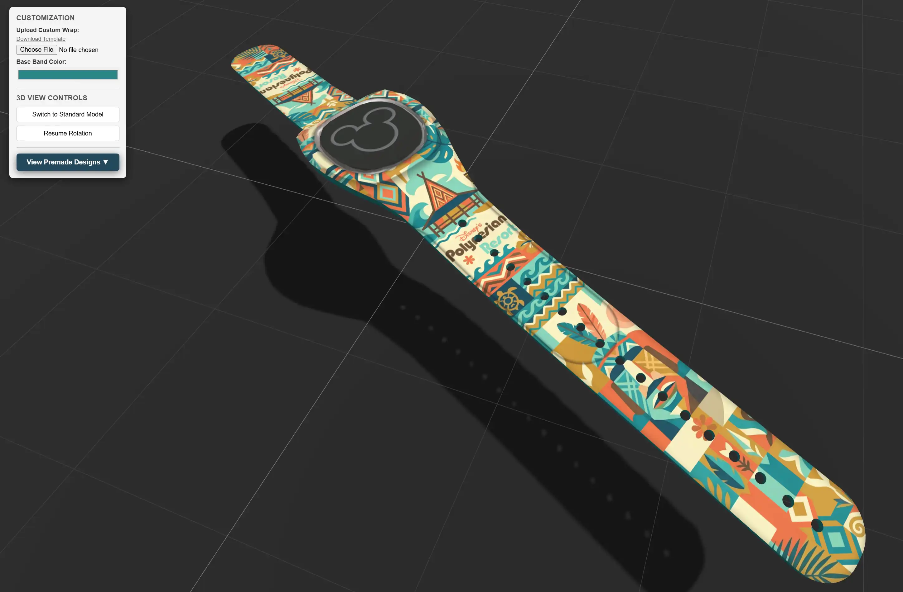

 

 

<h3 align="center">MagicBand+ | Customizer and 3D Viewer</h3>

Generate designs and models based on templates or custom designs
  
 <a href="https://ssambender.github.io/magicband-customizer/"><strong>Try it Online »</strong></a>

___

### Features
- 3D Models for different views
- Spatial camera zoom/rotate
- Change band material color
- Upload custom image
- 2 Templates to download
- My own designs included

---

 

---

### Planned features:
- [ ] Edit image directly in web

_Feel free to submit pull requests!_

---

### Libraries used:
- Three.JS

### Assets used:
- (Magic Band Model - Sam Bender)
